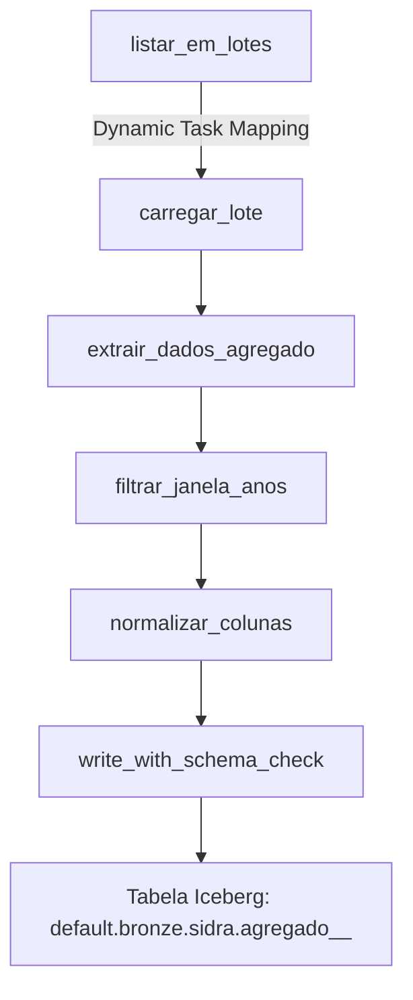
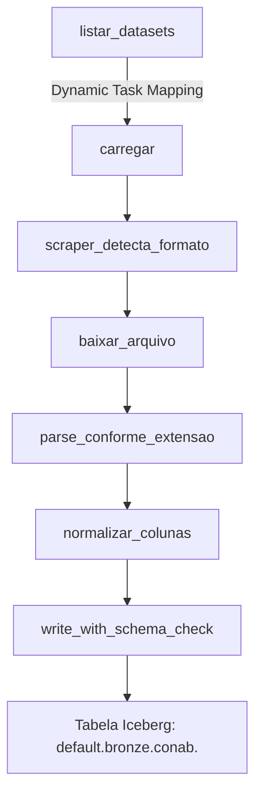
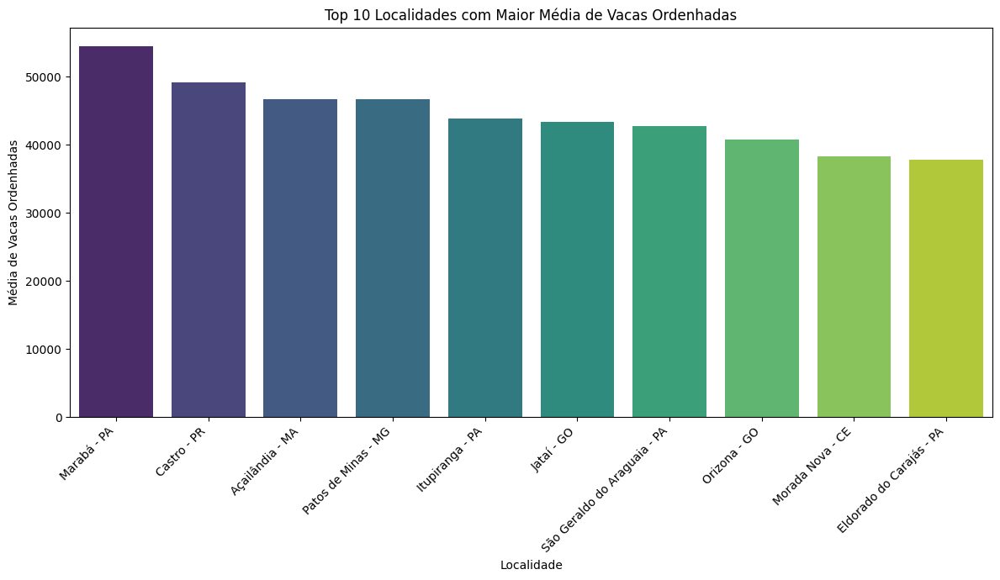
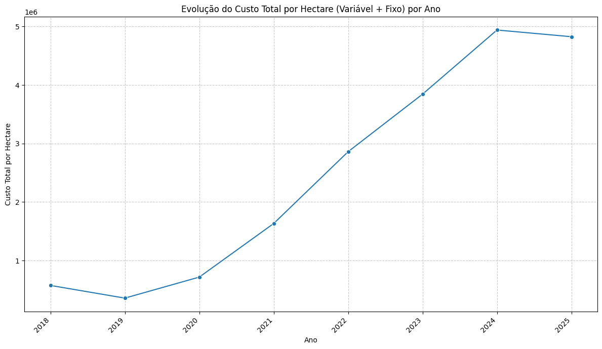

# **Pipeline de dados agrícolas: Da coleta ao Data Lake**

**Autores:** Nathan M. S. C.  
**Instituição:** Universidade Federal de Mato Grosso - UFMT  
**Data:** Julho 2026  

---

## **Resumo**

Este projeto apresenta a arquitetura e a modelagem de um ecossistema de dados voltado à coleta, consolidação, processamento e disponibilização de informações estratégicas do agronegócio brasileiro em um Data Lake centralizado. O pipeline ingere dados de fontes oficiais (IBGE SIDRA, CONAB, INMET, EMBRAPA) e os armazena em tabelas Apache Iceberg no Cloudflare R2, processados via Apache Spark orquestrado pelo Apache Airflow. A solução aplica princípios de engenharia de software, arquitetura de dados moderna, DataOps, versionamento de dados, processamento distribuído e governança para assegurar qualidade, escalabilidade, reprodutibilidade e eficiência analítica.

**Palavras-chave:** Engenharia de Dados, Data Lake, Apache Iceberg, Apache Airflow, Apache Spark, Cloudflare R2, Agronegócio, UML, Engenharia de Software, Evolução de Schema.

---

## **1. Introdução**

A modelagem de sistemas de software é frequentemente percebida pelos estudantes e profissionais como uma etapa puramente burocrática ou acadêmica, distanciada da "realidade" da codificação. No entanto, a prática profissional demonstra que a ausência de uma modelagem robusta é a causa primária do fracasso em projetos complexos (PRESSMAN, 2010; SOMMERVILLE, 2011). No contexto do agronegócio brasileiro, a modelagem não ser vista apenas como um conjunto de documentos estáticos, mas como um **processo dinâmico de descoberta, design e validação de soluções** .

O agronegócio brasileiro representa aproximadamente 27% do PIB nacional (CEPEA/USP, 2024) e gera volumes massivos de dados heterogêneos espalhados em portais governamentais: IBGE SIDRA (agregados estatísticos), CONAB (safras e estoques), INMET (dados climáticos) e EMBRAPA (zonamento agrícola e modelos de produtividade). A fragmentação dessas fontes impede análises integradas e decisões baseadas em dados consolidados.

Este artigo documenta a arquitetura estruturada em torno de artefatos práticos de modelagem, fundamentados em autores clássicos da engenharia de software e aplicados ao domínio do agronegócio. A solução implementa um pipeline **ELT (Extract-Load-Transform)** moderno com **Apache Iceberg** para transações ACID em Data Lake, **Apache Airflow** para orquestração com *Dynamic Task Mapping*, e **Apache Spark** para processamento distribuído, tudo armazenado no **Cloudflare R2**.

---

## **2. Fundamentação Teórica: Engenharia de Software e Resolução de Problemas**

### **2.1 A Natureza do Problema: Sistemas Complexos de Dados**

Segundo Pressman (2010), a engenharia de software é a "aplicação de uma abordagem sistemática, disciplinada e quantificável ao desenvolvimento, operação e manutenção de software". Estendendo esse princípio para **engenharia de dados**: a aplicação de abordagem sistemática à construção de pipelines de dados confiáveis, evolutivos e auditáveis.

Sommerville (2011) enfatiza que **software é um produto lógico**, não físico, e suas características — invisibilidade, complexidade, conformidade e mutabilidade — aplicam-se integralmente a pipelines de dados:
- **Invisibilidade:** Dados fluem entre sistemas sem representação física tangível
- **Complexidade:** Centenas de agregados IBGE, datasets CONAB dinâmicos, séries temporais INMET
- **Conformidade:** Necessidade de aderir a schemas oficiais, nomenclaturas do IBGE, padrões CONAB
- **Mutabilidade:** Schemas evoluem (novas variáveis IBGE, novas safras CONAB, novos postos INMET)

### **2.2 Processo de Software: Iterativo e Incremental**

O pipeline adota o **Desenvolvimento Iterativo e Incremental** (LARMAN, 2004), onde cada iteração entrega um incremento funcional do Data Lake:
- **Iteração 1:** IBGE Agregados (PPM completo + Censo Agro filtrado por temas)
- **Iteração 2:** CONAB (scraper dinâmico + Dynamic Task Mapping)
- **Iteração 3:** INMET (dados climáticos históricos)
- **Iteração 4:** EMBRAPA AgroAPI (ZARC, produtividade)

Cada iteração passa pelas disciplinas unificadas do **RUP (Rational Unified Process)** adaptadas para dados: Modelagem de Negócio, Requisitos, Análise & Design, Implementação, Teste, Implantação.


---

## **3. Documento de Visão: Escopo e Stakeholders**

### **3.1 Declaração do Problema**

| O problema de | fragmentação de dados oficiais do agronegócio brasileiro |
|---------------|----------------------------------------------------------|
| afeta | analistas de mercado, formuladores de políticas, pesquisadores, traders, produtores |
| cujo impacto é | impossibilidade de análises integradas, decisões baseadas em dados parciais, ineficiência de mercado |
| uma solução bem-sucedida seria | Data Lake centralizado, versionado, com schema evoluído controladamente, acessível via SQL |

### **3.2 Stakeholders e Necessidades**

| Stakeholder | Papel | Necessidades Principais |
|-------------|-------|-------------------------|
| **Analista de Mercado** | Consumidor final | Consultas SQL unificadas, séries temporais consistentes, baixa latência |
| **Pesquisador (EMBRAPA/Universidades)** | Consumidor avançado | Dados brutos + metadados completos, reprodutibilidade, versionamento |
| **Formulador de Políticas (MAPA/Conab)** | Tomador de decisão | Dashboards atualizados, alertas de anomalias, séries oficiais validadas |
| **Engenheiro de Dados (Equipe AGRODATA)** | Construtor/Operador | Pipeline resiliente, evolução de schema sem downtime, observabilidade |
| **DevOps / Cloud Engineer** | Operador de infraestrutura | Custo controlado (R2), escalabilidade (Spark), deploy automatizado (Docker/Airflow) |

### **3.3 Restrições Arquiteturais**

| Restrição | Descrição | Impacto no Design |
|-----------|-----------|-------------------|
| **Fontes externas não controladas** | APIs IBGE, portal CONAB, FTP INMET | Scrapers resilientes, retry exponencial, idempotência |
| **Custo de armazenamento** | Cloudflare R2 (pay-per-request) | Formato colunar (Parquet/Iceberg), particionamento inteligente, compressão ZSTD |
| **Latência aceitável** | Atualização diária (não real-time) | Batch processing noturno, Spark jobs otimizados |
| **Evolução de schema** | IBGE adiciona variáveis, CONAB muda layouts | Iceberg schema evolution controlada (3 caminhos) |
| **Governança** | LGPD, dados públicos | Pseudonimização onde aplicável, auditoria de acesso |

---

## **4. Engenharia de Requisitos: Elicitação, Análise e Especificação**

### **4.1 Requisitos Funcionais (RF)**

| ID | Requisito | Prioridade | Fonte |
|----|-----------|------------|-------|
| **RF-01** | Ingerir todos os agregados da PPM (IBGE) ~15 tabelas | Alta | IBGE SIDRA |
| **RF-02** | Ingerir agregados do Censo Agropecuário filtrados por temas (irrigação, máquinas, demografia rural, valor da produção) ~357 agregados | Alta | IBGE SIDRA |
| **RF-03** | Excluir automaticamente séries encerradas (IBGE) | Média | IBGE SIDRA |
| **RF-04** | Scraper 100% dinâmico do portal CONAB (categorias, tabelas, URLs, extensões descobertos em runtime) | Alta | CONAB |
| **RF-05** | Dynamic Task Mapping no Airflow: uma task mapeada por dataset descoberto | Alta | Airflow 3.0 |
| **RF-06** | Suportar formatos CONAB: TXT (CSV `;`), XLS, XLSX, CSV | Alta | CONAB |
| **RF-07** | Ingerir dados climáticos INMET (temperatura, precipitação, umidade, radiação, vento, evapotranspiração) | Média | INMET |
| **RF-08** | Ingerir ZARC, modelos de produtividade, indicadores EMBRAPA AgroAPI | Baixa | EMBRAPA |
| **RF-09** | Armazenar em tabelas Apache Iceberg no Cloudflare R2 | Alta | Arquitetura |
| **RF-10** | Evolução controlada de schema: 3 caminhos (idêntico, colunas novas, conflito de tipo) | Alta | Iceberg 1.10 |
| **RF-11** | Normalização Unicode → ASCII + lowercase + `_` para colunas/tabelas | Média | Padrão interno |
| **RF-12** | Janela de calendário IBGE: buscar períodos por ano ∈ [ano_atual - janela, ano_atual] | Alta | IBGE SIDRA |
| **RF-13** | Processamento em lotes de 25 agregados IBGE por SparkSession | Alta | Otimização JVM |
| **RF-14** | Retries: 2 tentativas, delay 2min para tasks de ingestão | Média | Resiliência |

### **4.2 Requisitos Não-Funcionais (RNF)**

| ID | Requisito | Métrica/Critério |
|----|-----------|------------------|
| **RNF-01** | **Disponibilidade** | Pipeline roda diariamente; falha de uma fonte não bloqueia outras |
| **RNF-02** | **Integridade** | Zero perda de dados; Iceberg ACID + snapshot isolation |
| **RNF-03** | **Rastreabilidade** | Linhagem completa: fonte → raw → bronze → silver → gold |
| **RNF-04** | **Performance** | Ingestão IBGE completa (< 357 agregados) em < 4h; CONAB < 2h |
| **RNF-05** | **Custo** | R2 storage + requests < $50/mês para volume atual |
| **RNF-06** | **Segurança** | Tokens R2 em Airflow Variables/Connections (não no código) |
| **RNF-07** | **Manutenibilidade** | DAGs dinâmicas; adição de fonte = configuração, não código |
| **RNF-08** | **Observabilidade** | Logs estruturados, métricas Spark UI, Airflow UI, alertas falha |

### **4.3 Casos de Uso Principais (UML Use Case)**

```
<<actor>> Analista de Mercado
<<actor>> Engenheiro de Dados
<<actor>> Sistema Externo (IBGE, CONAB, INMET, EMBRAPA)

UC-01: Consultar Dados Consolidados (Analista)
UC-02: Executar Pipeline Diário (Engenheiro/Scheduler)
UC-03: Ingerir Agregados IBGE (Sistema IBGE)
UC-04: Ingerir Datasets CONAB (Sistema CONAB)
UC-05: Ingerir Dados INMET (Sistema INMET)
UC-06: Evoluir Schema Iceberg (Engenheiro)
UC-07: Monitorar Falhas e Retries (Engenheiro)
```

---

## **5. Arquitetura de Software: Visão 4+1 (Kruchten)**

### **5.1 Visão Lógica: Camadas e Componentes**

```
┌─────────────────────────────────────────────────────────────────┐
│                        CAMADA DE APRESENTAÇÃO                   │
│  ┌─────────────┐  ┌─────────────┐  ┌─────────────┐              │
│  │  Trino/     │  │  Apache     │  │  Jupyter/   │              │
│  │  Presto     │  │  Superset   │  │  Python SDK │              │
│  └──────┬──────┘  └──────┬──────┘  └──────┬──────┘              │
└─────────┼────────────────┼────────────────┼─────────────────────┘
          │                │                │
┌─────────▼────────────────▼────────────────▼─────────────────────┐
│                      CAMADA DE SERVIÇOS / CATÁLOGO              │
│  ┌─────────────────────────────────────────────────────────┐    │
│  │           Iceberg REST Catalog (PostgreSQL backend)     │    │
│  │  • Metadados de tabelas (schema, partições, snapshots)  │    │
│  │  • Time travel, rollback, branch/tag                    │    │
│  └─────────────────────────────────────────────────────────┘    │
└────────────────────────────┬────────────────────────────────────┘
                             │
┌────────────────────────────▼────────────────────────────────────┐
│                    CAMADA DE PROCESSAMENTO (SPARK)              │
│  ┌─────────────────┐  ┌─────────────────┐  ┌─────────────────┐  │
│  │  Bronze Layer   │  │  Silver Layer   │  │  Gold Layer     │  │
│  │  (Raw Ingest)   │──▶│  (Clean/Typed)  │──▶│  (Analytics)    │  │
│  │  default.bronze │  │  default.silver │  │  default.gold   │  │
│  └─────────────────┘  └─────────────────┘  └─────────────────┘  │
└────────────────────────────┬────────────────────────────────────┘
                             │
┌────────────────────────────▼────────────────────────────────────┐
│                     CAMADA DE ARMAZENAMENTO (R2)                │
│  s3://<bucket>/warehouse/                                       │
│  ├── default/bronze/conab/<tabela>/                             │
│  ├── default/bronze/sidra/agregado_<id>_<nome>/                │
│  ├── default/silver/...                                         │
│  └── default/gold/...                                           │
└─────────────────────────────────────────────────────────────────┘
```

### **5.2 Visão de Processo: Orquestração Airflow 3.0**

#### **DAG: `agregados` (IBGE SIDRA)**



- **`listar_em_lotes`**: Consulta API IBGE `/agregados`, filtra PPM + Censo temas, agrupa em lotes de 25 (constante `TAMANHO_LOTE = 25`)
- **`carregar_lote.expand(lote=lotes)`**: Dynamic Task Mapping — uma task Spark por lote
- **Janela de calendário**: Períodos com ano ∈ `[ano_atual - anos_de_janela, ano_atual]` (evita censos irregulares: 1985, 1995, 2006, 2017)
- **Uma SparkSession por lote**: Evita overhead de JVM (~357 sessions seria proibitivo)

#### **DAG: `conab` (Portal CONAB)**



- **`listar_datasets`**: Scraper dinâmico lê `https://portaldeinformacoes.conab.gov.br/download-arquivos.html`, extrai categorias → tabelas → URLs → extensões
- **Formatos suportados**: TXT (CSV `;`), XLS, XLSX, CSV
- **Encoding forçado**: `resp.encoding = "utf-8"` (servidor não envia charset)

### **5.3 Visão de Implementação: Docker + Infraestrutura**

```dockerfile
# Dockerfile (CORE/AIRFLOW/Dockerfile) - Resumo
FROM apache/airflow:3.0.0-python3.11
USER root
RUN apt-get update && apt-get install -y openjdk-17-jre-headless
# Jars Iceberg pré-baixados:
# iceberg-spark-runtime-4.0_2.13-1.10.1.jar
# iceberg-aws-bundle-1.10.1.jar
ENV SPARK_LOCAL_IP=127.0.0.1
ENV SPARK_DRIVER_BIND_ADDRESS=127.0.0.1
```

**Docker Compose (`core.yml`)**:
- **Airflow Webserver** (porta 8080): admin/admin
- **Airflow Scheduler**
- **PostgreSQL** (porta 5432): airflow/airflow (metadados Airflow + Catálogo Iceberg REST)
- **pgAdmin4** (porta 5050): user@site.com / password

### **5.4 Visão de Implantação: Cloudflare R2 + Iceberg REST Catalog**

```python
# spark/ingest.py - get_spark() configuração essencial
spark = (SparkSession.builder
    .appName("AGRODATA-PA")
    .config("spark.sql.catalog.my_catalog", "org.apache.iceberg.spark.SparkCatalog")
    .config("spark.sql.catalog.my_catalog.type", "rest")
    .config("spark.sql.catalog.my_catalog.uri", CATALOG_URI)  # https://<account>.r2.cloudflarestorage.com
    .config("spark.sql.catalog.my_catalog.warehouse", WAREHOUSE)  # s3://<bucket>/warehouse
    .config("spark.sql.catalog.my_catalog.header.Authorization", f"Bearer {TOKEN}")
    .config("spark.sql.catalog.my_catalog.header.X-Iceberg-Access-Delegation", "vended-credentials")
    .config("spark.sql.catalog.my_catalog.s3.remote-signing-enabled", "false")  # R2 usa assinatura própria
    .config("spark.jars", "jars/iceberg-spark-runtime-4.0_2.13-1.10.1.jar,jars/iceberg-aws-bundle-1.10.1.jar")
    .getOrCreate())
```

---

## **6. Modelagem de Dados: Do Conceitual ao Físico (Iceberg)**

### **6.1 Modelo Conceitual (Entidade-Relacionamento)**

```
┌─────────────┐       ┌─────────────┐       ┌─────────────┐
│   FONTE     │       │   AGREGADO  │       │  VARIÁVEL   │
│  (IBGE/     │───────│  (PPM/Censo)│───────│  (Produção, │
│   CONAB/    │       │             │       │   Área,     │
│   INMET)    │       │             │       │   Rebanho)  │
└─────────────┘       └──────┬──────┘       └─────────────┘
                             │
                    ┌────────▼────────┐
                    │   PERÍODO       │
                    │ (Ano, Trimestre,│
                    │  Mês, Safra)    │
                    └────────┬────────┘
                             │
                    ┌────────▼────────┐
                    │   LOCALIDADE    │
                    │ (Brasil, UF,    │
                    │  Município)     │
                    └─────────────────┘
```

### **6.2 Modelo Lógico: Namespace Iceberg**

| Camada | Namespace | Descrição | Particionamento Típico |
|--------|-----------|-----------|------------------------|
| **Bronze** | `default.bronze.sidra.agregado_<id>_<nome>` | Dados brutos IBGE (tipos string) | `ano`, `nivel_territorial` |
| **Bronze** | `default.bronze.conab.<tabela>` | Dados brutos CONAB (tipos string) | `ano`, `mes`, `uf` |
| **Silver** | `default.silver.sidra.agregado_<id>_<nome>` | Tipados, normalizados, deduplicados | `ano`, `variavel_id` |
| **Silver** | `default.silver.conab.<tabela>` | Tipados, normalizados, deduplicados | `ano`, `mes`, `produto` |
| **Gold** | `default.gold.agro.<dominio>` | Agregados analíticos (produção por UF/ano, yield) | `ano`, `uf` |

### **6.3 Normalização de Nomes (Padrão Obrigatório)**

```python
# utils/conab_scraper.py::normalize
# spark/ingest.py::_normalize_column_name
import unicodedata
import re

def normalize(name: str) -> str:
    # Unicode → ASCII (remove acentos)
    name = unicodedata.normalize('NFKD', name)
    name = name.encode('ascii', 'ignore').decode('ascii')
    # Lowercase
    name = name.lower()
    # Não alfanumérico → underscore
    name = re.sub(r'[^a-z0-9]+', '_', name)
    # Remove underscores duplicados e bordas
    name = re.sub(r'_+', '_', name).strip('_')
    return name
```

**Exemplos:**
- `"Área Colhida (ha)"` → `area_colhida_ha`
- `"Produção (ton)"` → `producao_ton`
- `"Valor da Produção (R$ 1000)"` → `valor_da_producao_r_1000`

### **6.4 Evolução Controlada de Schema (spark/schema_evolution.py)**


```python
from spark.schema_evolution import write_with_schema_check

write_with_schema_check(spark, df, table_fqn)
```

| Cenário | Detecção | Ação |
|---------|----------|------|
| **1. Schemas idênticos** | `df.schema == table.schema` | `df.writeTo(table).append()` |
| **2. Apenas colunas novas** | `new_cols = df.schema - table.schema`; `removed = ∅`; `type_changes = ∅` | `spark.sql(f"ALTER TABLE {table} ADD COLUMNS ({new_cols_def})")` + `append()` |
| **3. Conflito de tipo** | Coluna existe em ambos com tipo diferente | **Backup**: `ALTER TABLE {table} RENAME TO {table}_bkp_<timestamp>` + **Recriar**: `df.writeTo(table).createOrReplace()` |

**Exemplo de detecção:**
```python
def _compare_schemas(df_schema, table_schema):
    df_fields = {f.name: f.dataType for f in df_schema.fields}
    tbl_fields = {f.name: f.dataType for f in table_schema.fields}
    
    new_cols = set(df_fields) - set(tbl_fields)
    removed_cols = set(tbl_fields) - set(df_fields)
    type_changes = {c for c in set(df_fields) & set(tbl_fields) 
                    if df_fields[c] != tbl_fields[c]}
    
    return new_cols, removed_cols, type_changes
```

### **6.5 Tratamento de Tabelas "Fantasma" (NoSuchKeyException)**

Problema: Tabela existe no catálogo (metadados) mas não tem dados no R2 (404 no write).
```python
# spark/ingest.py - write_with_schema_check()
try:
    write_with_schema_check(spark, df, table_fqn)
except NoSuchKeyException:
    # Tabela fantasma: dropa metadados e recria via createOrReplace
    spark.sql(f"DROP TABLE IF EXISTS {table_fqn}")
    df.writeTo(table_fqn).createOrReplace()
```

---

## **7. Gestão de Projeto: Cronograma e Riscos**

### **7.1 Cronograma (Roadmap por Iterações)**

| Iteração | Entregável | Duração | Critério de Aceite |
|----------|------------|---------|-------------------|
| **Sprint 0** | Infraestrutura base (Docker, Airflow, Spark, R2, Catálogo) | 2 semanas | `docker compose up` sobe stack; `spark-submit` escreve tabela teste no R2 |
| **Sprint 1** | IBGE PPM completo (15 agregados) | 3 semanas | 15 tabelas Bronze no R2; contagem de linhas = API IBGE |
| **Sprint 2** | IBGE Censo Agro filtrado (357 agregados, lotes de 25) | 4 semanas | 357 tabelas Bronze; janela de anos funcionando; uma SparkSession/lote |
| **Sprint 3** | CONAB Scraper Dinâmico + Dynamic Task Mapping | 3 semanas | DAG descobre datasets em runtime; ingere TXT/XLS/XLSX/CSV; schema evolution OK |
| **Sprint 4** | INMET (dados climáticos) | 2 semanas | Séries históricas por estação; particionamento ano/mês/UF |
| **Sprint 5** | EMBRAPA AgroAPI (ZARC, produtividade) | 2 semanas | Endpoints autenticados; modelos integrados ao Gold |
| **Sprint 6** | Camada Silver + Gold + Documentação + Testes | 3 semanas | Tabelas tipadas, deduplicadas; views analíticas; README + runbooks |

### **7.2 Análise de Riscos (Matriz Probabilidade × Impacto)**

| ID | Risco | Prob. | Impacto | Mitigação | Residual |
|----|-------|-------|---------|-----------|----------|
| **R01** | API IBGE SIDRA retorna 500 (requisição grande) | Alta | Alta | Buscar **um período por vez** + janela de calendário (`ibge_extractor.py`) | Média |
| **R02** | JVM Spark falha (JAVA_GATEWAY_EXITED / NullPointer BlockManager) | Média | Crítica | Docker com OpenJDK 17 + `SPARK_LOCAL_IP=127.0.0.1` + `spark.driver.bindAddress=127.0.0.1` | Baixa |
| **R03** | Tabela fantasma no catálogo (metadados sem dados no R2) | Média | Alta | Try/catch `NoSuchKeyException` → `DROP TABLE` + `createOrReplace()` | Baixa |
| **R04** | Token R2 expira / Iceberg REST Catalog falha auth | Baixa | Crítica | Header `Authorization: Bearer` manual + `X-Iceberg-Access-Delegation`; rotação via Airflow Variables | Baixa |
| **R05** | CONAB muda layout do portal (scraper quebra) | Média | Média | Scraper 100% dinâmico (sem seletores fixos); logs de parsing para debug rápido | Média |
| **R06** | Evolução de schema quebrada (merge-schema implícito) | Baixa | Crítica | **Proibido** `merge-schema`; módulo `schema_evolution.py` obrigatório | Baixa |
| **R07** | Custo R2 explode (requests/.storage) | Baixa | Média | Particionamento inteligente; compressão ZSTD; compactação de arquivos pequenos (rewrite) | Baixa |
| **R08** | Falha de rede durante write Iceberg (arquivo parcial) | Baixa | Alta | Iceberg ACID + commit atômico; retry Airflow (2x, 2min) | Baixa |

### **7.3 Métricas de Sucesso (KPIs)**

| Métrica | Target | Ferramenta de Medição |
|---------|--------|----------------------|
| **Freshness** | Dados de D-1 disponíveis às 06:00 | Airflow UI / SLA |
| **Completude IBGE** | 100% agregados alvo ingeridos | Contagem tabelas Bronze vs. lista alvo |
| **Completude CONAB** | 100% datasets descobertos ingeridos | `listar_datasets()` count vs. `carregar` mapped tasks |
| **Taxa de falha pipeline** | < 5% tasks falham por execução | Airflow metrics / Prometheus |
| **Tempo ingestão IBGE** | < 4 horas (357 agregados) | Spark History Server |
| **Custo R2 mensal** | < $50 | Cloudflare Dashboard |
| **Schema evolution success** | 100% writes sem erro de schema | Logs `schema_evolution.py` |

---

## **8. Padrões de Código Críticos e Lições Aprendidas**

### **8.1 Dynamic Task Mapping (Airflow 3.0)**

```python
# dags/conab.py
@task
def listar_datasets() -> list[dict]:
    """Scraper dinâmico retorna lista de dicts: {categoria, tabela, url, extensao}"""
    return scraper.listar_datasets()

@task
def carregar(item: dict):
    """Uma task mapeada por dataset descoberto"""
    df = baixar_e_parsear(item)
    write_with_schema_check(spark, df, f"default.bronze.conab.{normalize(item['tabela'])}")

# Dynamic Task Mapping: Airflow cria N tasks 'carregar' em runtime
datasets = listar_datasets()
carregar.expand(item=datasets)
```

**Vantagem:** Adição de novo dataset no portal CONAB → **zero mudança de código**, nova task criada automaticamente na próxima execução.

### **8.2 Processamento em Lotes (IBGE) — Otimização de JVM**

```python
# dags/agregados.py
TAMANHO_LOTE = 25  # Constante ajustável

@task
def listar_em_lotes() -> list[list[str]]:
    agregados = ibge_client.listar_agregados_alvo()  # ~357 IDs
    lotes = [agregados[i:i+TAMANHO_LOTE] for i in range(0, len(agregados), TAMANHO_LOTE)]
    return lotes

@task
def carregar_lote(lote: list[str]):
    """Uma SparkSession processa 25 agregados sequencialmente"""
    spark = get_spark()
    for agregado_id in lote:
        df = extrair_dados(agregado_id)
        write_with_schema_check(spark, df, f"default.bronze.sidra.agregado_{agregado_id}_{nome}")
    spark.stop()

lotes = listar_em_lotes()
carregar_lote.expand(lote=lotes)
```


### **8.3 Janela de Calendário vs. "Últimos N Períodos"**

```python
# ibge_extractor.py::_filtrar_por_janela_de_anos
def _filtrar_por_janela_de_anos(periodos: list[str], anos_de_janela: int) -> list[str]:
    ano_atual = datetime.now().year
    ano_minimo = ano_atual - anos_de_janela
    return [p for p in periodos if ano_minimo <= _ano_do_periodo(p) <= ano_atual]
```


### **8.4 Encoding Forçado no Scraper CONAB**

```python
# conab_scraper.py
resp = requests.get(url, timeout=30)
resp.encoding = "utf-8"  # CRÍTICO: servidor não manda charset, requests assume ISO-8859-1
html = resp.text
```

Sem isso, caracteres acentuados em nomes de tabelas/categorias corrompem → falha no parse → tabela não ingerida.

## **8.5 Análise exploratória dos dados**

As análises contemplam informações sobre produção leiteira e custos de produção agrícola, demonstrando a aplicação de tecnologias modernas para processamento analítico de grandes volumes de dados.

Na tabela default.bronze.sidra.agregado_94_vacas_ordenhadas, foram identificadas as dez localidades com maior média de vacas ordenhadas, permitindo destacar os principais polos produtores de leite no país. Também foi realizada uma análise da evolução temporal da quantidade total de vacas ordenhadas, possibilitando observar tendências e variações da produção ao longo dos anos.


Os resultados evidenciam o potencial da arquitetura Data Lakehouse baseada em Apache Iceberg, Cloudflare R2 e Apache Spark para integrar, armazenar e analisar dados públicos do agronegócio de forma escalável, possibilitando análises espaciais e temporais que apoiam a geração de indicadores estratégicos e a tomada de decisão.

```py
import matplotlib.pyplot as plt
import seaborn as sns

# Ordenar por média de vacas ordenhadas em ordem decrescente e pegar o top 10
top_10_localidades = avg_vacas_por_localidade.orderBy("avg(valor)", ascending=False).limit(10)

# Converter para Pandas DataFrame para facilitar a visualização
top_10_localidades_pd = top_10_localidades.toPandas()

# Criar o gráfico de barras
plt.figure(figsize=(12, 7))
sns.barplot(x="localidade_nome", y="avg(valor)", data=top_10_localidades_pd, hue="localidade_nome", palette="viridis", legend=False)
plt.title("Top 10 Localidades com Maior Média de Vacas Ordenhadas")
plt.xlabel("Localidade")
plt.ylabel("Média de Vacas Ordenhadas")
plt.xticks(rotation=45, ha="right")
plt.tight_layout()
plt.show()

```


Na tabela default.bronze.conab.custo_de_producao, foi calculado o custo total de produção por hectare, considerando a soma dos custos variáveis e fixos. A evolução anual desse indicador permitiu avaliar o comportamento dos custos agrícolas ao longo do tempo, fornecendo uma visão histórica importante para análises econômicas e de planejamento.

```py
import matplotlib.pyplot as plt
import seaborn as sns

# Agrupar por ano e somar os custos variáveis e fixos por hectare
custo_anual = custo_df.groupBy("ano").sum("vlr_custo_variavel_ha", "vlr_custo_fixo_ha").orderBy("ano")

# Renomear as colunas para facilitar a visualização
custo_anual = custo_anual.withColumnRenamed("sum(vlr_custo_variavel_ha)", "total_custo_variavel_ha") \
                           .withColumnRenamed("sum(vlr_custo_fixo_ha)", "total_custo_fixo_ha")

# Calcular o custo total por hectare
custo_anual = custo_anual.withColumn("total_custo_ha", custo_anual["total_custo_variavel_ha"] + custo_anual["total_custo_fixo_ha"])

# Converter para Pandas DataFrame para facilitar a visualização
custo_anual_pd = custo_anual.toPandas()

# Criar o gráfico de linha para a evolução do custo total
plt.figure(figsize=(12, 7))
sns.lineplot(x="ano", y="total_custo_ha", data=custo_anual_pd, marker='o')
plt.title("Evolução do Custo Total por Hectare (Variável + Fixo) por Ano")
plt.xlabel("Ano")
plt.ylabel("Custo Total por Hectare")
plt.xticks(rotation=45, ha="right")
plt.grid(True, linestyle='--', alpha=0.7)
plt.tight_layout()
plt.show()
```


Os resultados evidenciam o potencial da arquitetura Data Lakehouse baseada em Apache Iceberg, Cloudflare R2 e Apache Spark para integrar, armazenar e analisar dados públicos do agronegócio de forma escalável, possibilitando análises espaciais e temporais que apoiam a geração de indicadores estratégicos e a tomada de decisão.

---
## **Conclusão**

A modelagem no AGRODATA-PA não é uma fase anterior à implementação — ela **permeia todo o ciclo de vida**:

1. **Documento de Visão** alinha stakeholders e define fronteiras do problema
2. **Engenharia de Requisitos** traduz necessidades do agronegócio em RFs/RNFs testáveis
3. **Arquitetura 4+1** estrutura a solução em camadas desacopladas (Ingestão → Bronze → Silver → Gold)
4. **Modelagem de Dados** define namespaces Iceberg, normalização, particionamento e — crucialmente — **evolução de schema controlada em 3 caminhos**
5. **Gestão de Riscos** antecipa falhas reais (JVM, auth R2, API instável, schema drift) com mitigações implementadas em código

### **Principais Contribuições Técnicas Demonstradas**

| Área | Inovação/Prática |
|------|------------------|
| **Orquestração** | Dynamic Task Mapping para fontes dinâmicas (CONAB) + Lotes para fontes massivas (IBGE) |
| **Processamento** | Uma SparkSession por lote (25 agregados) = economia massiva de overhead JVM |
| **Armazenamento** | Iceberg no R2 com REST Catalog + auth Bearer manual (workaround Iceberg ≥1.9) |
| **Governança** | Schema evolution **explícita** (3 caminhos) — zero `merge-schema` implícito |
| **Resiliência** | Tratamento de tabelas fantasma, retry exponencial, encoding forçado, janela calendário |
| **Observabilidade** | Logs estruturados, Spark UI, Airflow UI, métricas de freshness/completude |

### **Trabalho Futuro**

1. **Camada Silver/Gold completa**: Transformações dbt/Spark SQL para tabelas analíticas prontas para BI
2. **Data Contracts**: Schemas Avro/Protobuf versionados no catálogo para validação na ingestão
3. **Data Quality**: Great Expectations / Soda Core integrados no pipeline (testes de completude, validade, consistência)
4. **Catálogo Unificado**: Integração com DataHub ou Amundsen para descoberta de dados
5. **Real-time / Near-real-time**: Kafka + Spark Structured Streaming para INMET (dados horários)
6. **ML Pipeline**: Features para modelos de previsão de safra (ZARC + histórico + clima)

---

## **Referências**

1. **PRESSMAN, R. S.** *Engenharia de Software: Uma Abordagem Profissional*. 7. ed. Porto Alegre: AMGH, 2010.
2. **SOMMERVILLE, I.** *Engenharia de Software*. 9. ed. São Paulo: Pearson, 2011.
3. **LARMAN, C.** *Applying UML and Patterns: An Introduction to Object-Oriented Analysis and Design and Iterative Development*. 3. ed. Upper Saddle River: Prentice Hall, 2004.
4. **COOPER, A.; REIMANN, R.; CRONIN, D.** *About Face 3: The Essentials of Interaction Design*. Indianapolis: Wiley, 2007.
5. **FOWLER, M.** *Patterns of Enterprise Application Architecture*. Boston: Addison-Wesley, 2003.
6. **KIMBALL, R.; ROSS, M.** *The Data Warehouse Toolkit: The Definitive Guide to Dimensional Modeling*. 3. ed. Wiley, 2013.
7. **APACHE SOFTWARE FOUNDATION.** *Apache Iceberg Documentation*. https://iceberg.apache.org/docs/latest/
8. **APACHE SOFTWARE FOUNDATION.** *Apache Airflow Documentation*. https://airflow.apache.org/docs/
9. **APACHE SOFTWARE FOUNDATION.** *Apache Spark Documentation*. https://spark.apache.org/docs/latest/
10. **CLOUDFLARE.** *R2 Storage Documentation*. https://developers.cloudflare.com/r2/
11. **IBGE.** *API SIDRA v3 - Documentação*. https://servicodados.ibge.gov.br/api/docs/agregados?versao=3
12. **CONAB.** *Portal de Informações Agropecuárias*. https://portaldeinformacoes.conab.gov.br/
13. **INMET.** *Banco de Dados Meteorológicos*. https://portal.inmet.gov.br/
14. **EMBRAPA.** *AgroAPI Documentation*. https://agroapi.embrapa.br/
15. **ACM/IEEE.** *Software Engineering Code of Ethics*. https://ethics.acm.org/code-of-ethics/

---

## **Apêndice A: Estrutura do Repositório AGRODATA-PA**

```
AGRODATA-PA/
├── CORE/
│   ├── AIRFLOW/
│   │   ├── dags/
│   │   │   ├── agregados.py              # DAG IBGE Agregados
│   │   │   ├── conab.py                  # DAG CONAB
│   │   │   ├── spark/
│   │   │   │   ├── ingest.py             # get_spark(), write_with_schema_check()
│   │   │   │   ├── agregados_metadados.py # Ingestão IBGE por lote
│   │   │   │   └── schema_evolution.py   # Evolução controlada (3 caminhos)
│   │   │   └── utils/
│   │   │       ├── conab_scraper.py      # Scraper dinâmico + normalize()
│   │   │       ├── ibge_client.py        # Cliente API SIDRA (filtros temáticos)
│   │   │       └── ibge_extractor.py     # Extrator genérico + janela calendário
│   │   ├── Dockerfile                    # Imagem customizada (OpenJDK 17 + Jars Iceberg)
│   │   ├── core.yml                      # Docker Compose (Airflow + Postgres + pgAdmin)
│   │   ├── requirements.txt
│   │   ├── airflow.cfg
│   │   └── spark-warehouse/              # Warehouse local (dev)
│   └── .env                              # Variáveis sensíveis (gitignored)
├── ANALYTICS/
│   ├── agregados.json                    # Export metadados agregados IBGE
│   ├── conab.ipynb                       # Notebook exploração CONAB
│   └── imnet.ipynb                       # Notebook exploração INMET
└── DOCUMENTS/
    ├── AnaliseEModelagemComUML.md
    ├── Artefatos para Modelagem de Software.md
    └── Material_Didatico_Engenharia de Software.md
```

---

## **Apêndice B: Comandos de Desenvolvimento Essenciais**

```bash
# Subir ambiente local
cd CORE/AIRFLOW
docker compose -f core.yml up -d

# Build imagem customizada (se mudou Dockerfile/requirements)
docker build -t airflow-pa:latest .

# Trigger DAGs manualmente
docker exec -it airflow-webserver airflow dags trigger agregados
docker exec -it airflow-webserver airflow dags trigger conab

# Testar módulos isoladamente
python -m dags.utils.conab_scraper
python -m dags.utils.ibge_client
python -c "from dags.utils.ibge_extractor import extrair_dados; print(extrair_dados('3939', anos_de_janela=1)[:3])"

# Ver logs
docker compose -f core.yml logs -f airflow-webserver
docker compose -f core.yml logs -f airflow-scheduler
```

---
## **Apêndice C: Links do projeto**

- [Notebook - Google Colab](https://colab.research.google.com/drive/1C1MHWbJ8A2zMjXAxAV9NZxLsbr19g0fZ?usp=sharing)
- [Github Repo](https://github.com/nathanmsc/AGRODATA-PA)